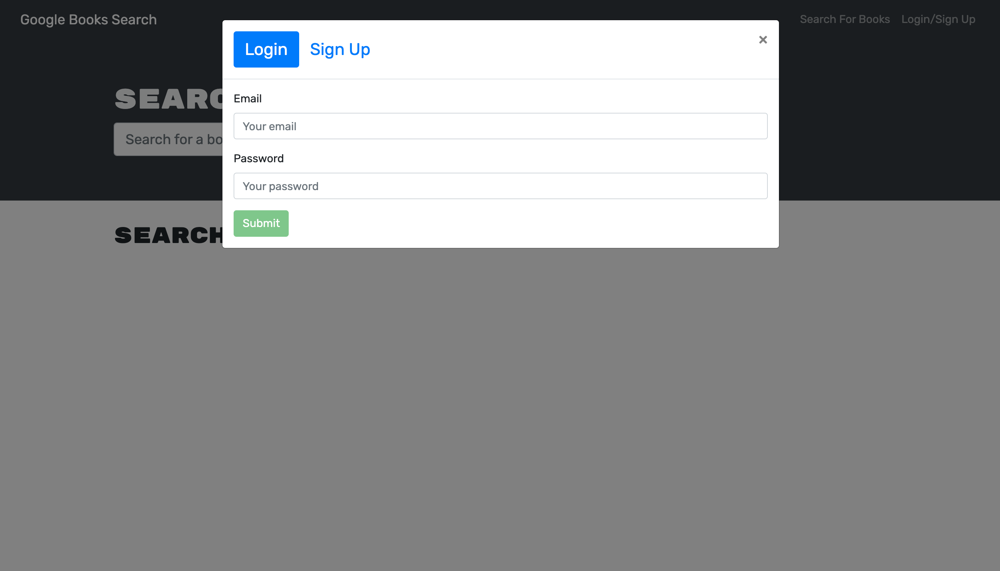
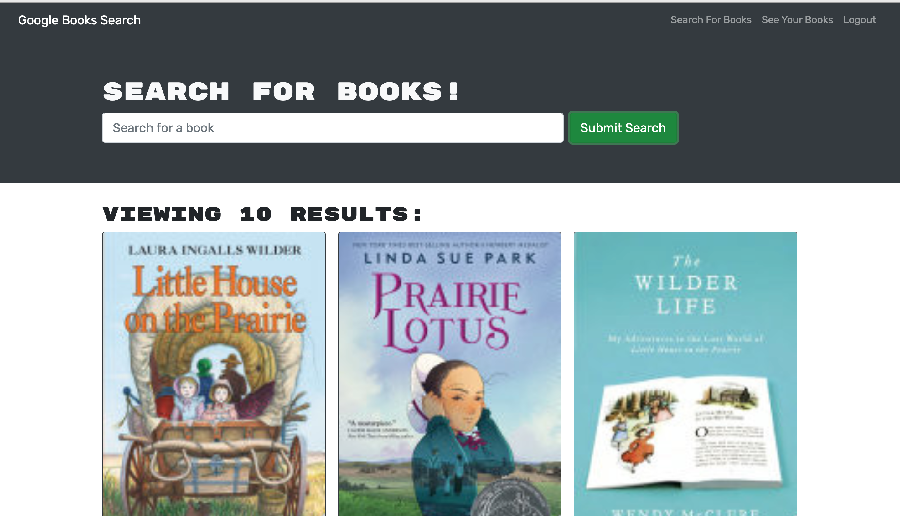
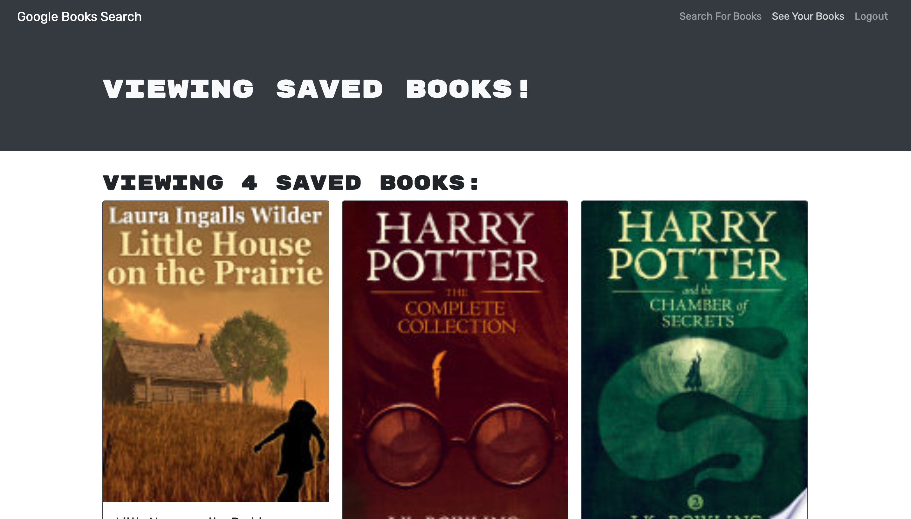

# book-find
# personal-portfolio-v3 

  

    
    
    
    
    

## Assignment
  A Google API Book Finder to keep a list of books to purchase
  
## Description
  This is an assignment from the University of Arizona Coding Bootcamp that had starter code for a fully functioning application that used a RESTful API. The assignment was to refactor the code to refactor it from RESTful API practices to a GraphQL API.
  
## Screenshots of web application 

## Table of Contents

* [Installation](#installation)
* [Usage](#usage)
* [Link](#link)
* [License](#license)

* * *

## Installation
  :one: Clone the repository to your terminal. 
  :two: Intall Node.js to your terminal. 
  :three: Install npm packages contained in the package.json
  :four: Type `npm start` from the root of your project's directory in the terminal window

## Usage
   This project utilizes Node.js, React, Apollo and GraphQL. 

## Link

> [link to Book-Find Application](https://sgiel-book-find.herokuapp.com/)
 
## License  
  
This application is covered under the MIT License. You may obtain a copy of the license at the link below:

(https://opensource.org/licenses/MIT)

    
